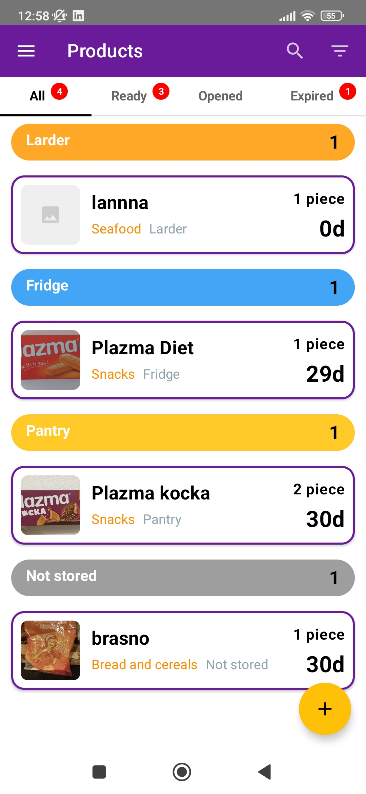
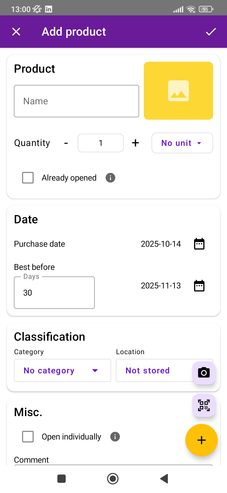
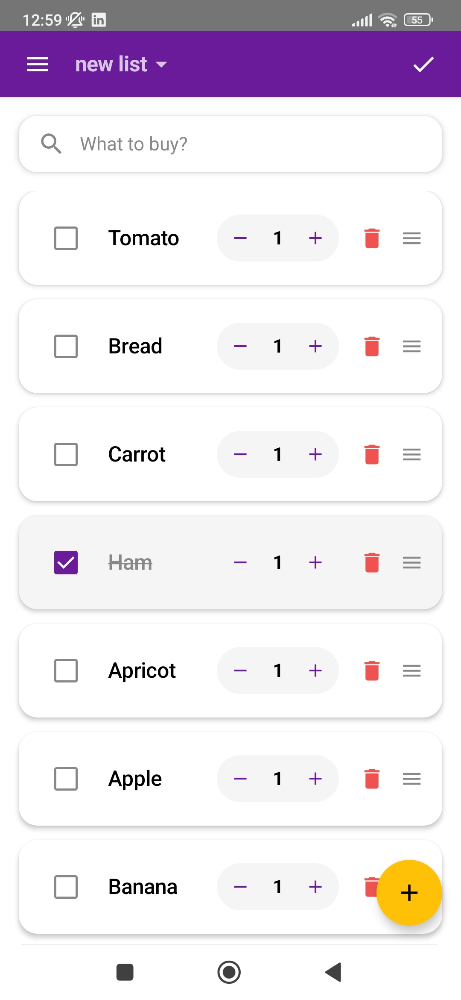
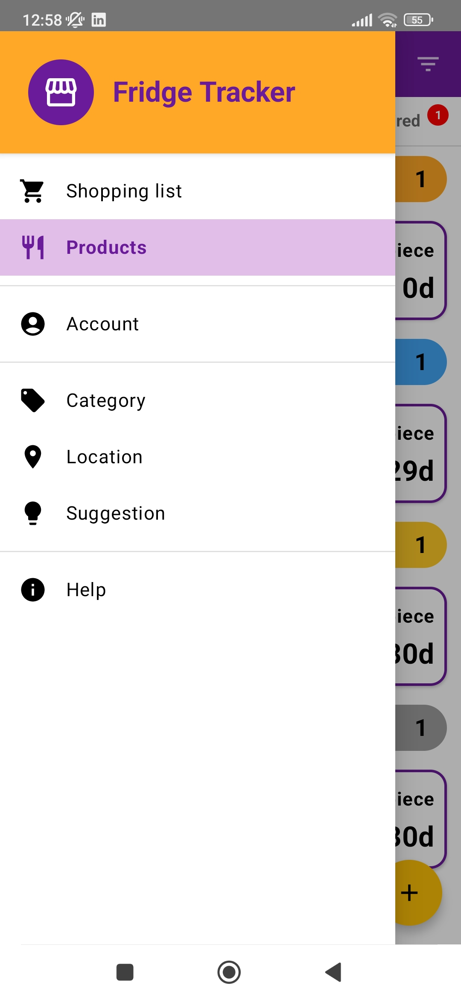

# Fridge Tracker

<div align="center">
  
  
  
  
  
</div>

<p align="center">
  <i>A modern Android application for tracking food inventory, managing expiry dates, and reducing food waste.</i>
</p>

---

## 📋 Table of Contents

- [Overview](#-overview)
- [Features](#-features)
- [Screenshots](#-screenshots)
- [Architecture](#-architecture)
- [Tech Stack](#-tech-stack)
- [Project Structure](#-project-structure)
- [Getting Started](#-getting-started)
- [Key Implementation Details](#-key-implementation-details)
- [Testing](#-testing)
- [Future Enhancements](#-future-enhancements)
- [License](#-license)

---

## 🎯 Overview

**Fridge Tracker** is a comprehensive food inventory management application built with modern Android development practices. The app helps users track products in their fridge, freezer, and pantry, manage expiration dates, receive timely notifications, and create shopping lists.

### Problem Statement
Food waste is a significant issue worldwide. This app addresses the problem by:
- Tracking product expiration dates with smart notifications
- Managing opened products with custom consumption tracking
- Providing organized inventory across multiple storage locations
- Creating shopping lists to prevent duplicate purchases

### Target Audience
- Families wanting to reduce food waste
- Individuals managing multiple storage locations
- Budget-conscious consumers tracking grocery expenses
- Anyone seeking better food inventory organization

---

## ✨ Features

### 🥗 Product Management
- **Add/Edit Products**: Comprehensive product entry with barcode scanning
- **Barcode Integration**: Scan barcodes to auto-populate product information via OpenFoodFacts API
- **Image Support**: Add photos via camera or gallery
- **Custom Categories**: 15+ predefined categories (Fruits, Vegetables, Meat, etc.)
- **Multiple Locations**: Track items across Fridge, Freezer, Pantry, Larder
- **Quantity Tracking**: Manage product quantities with flexible units (pcs, kg, L, etc.)

### ⏰ Smart Notifications
- **Expiry Reminders**: Customizable alerts before products expire (default: 4 days before)
- **After Opening Alerts**: Track consumption time after opening products
- **"Open Individually" Mode**: Special handling for items like fruits, eggs that don't spoil after opening
- **Background Worker**: Daily checks using WorkManager for reliable notifications

### 📊 Advanced Filtering & Sorting
- **Multi-Tab View**: All, Ready, Opened, Expired products
- **Smart Filters**: 
  - By category
  - By quantity range
  - By search query (name or barcode)
- **Flexible Sorting**:
  - By name
  - By purchase date
  - By best before date
  - By remaining quantity
  - By category
- **Ascending/Descending**: Toggle sort direction

### 🛒 Shopping Lists
- **Multiple Lists**: Create and manage multiple shopping lists
- **Drag & Drop Reordering**: Intuitive list organization
- **Smart Suggestions**: Pre-populated product suggestions
- **Quantity Management**: Track item quantities with +/- controls
- **Checkbox Tracking**: Mark items as purchased
- **Persistent Storage**: Lists saved to local database

### 🍽️ Consumption Tracking
- **Consume Dialog**: Easily consume partial quantities
- **Slider Interface**: Visual quantity selection
- **Trash Function**: Delete products with confirmation
- **Auto-Remove**: Products automatically removed when fully consumed

### 👤 User Profile
- **Personal Information**: Name, date of birth, weight, gender
- **Dietary Preferences**: Vegan, Vegetarian, Pork Free, Meat Free, No Beef
- **Dietary Restrictions**: Gluten Free, No Lactose, No Alcohol, No Shellfish, No Nuts
- **Persistent Storage**: Profile data saved locally

### 🎨 UI/UX Highlights
- **Material Design 3**: Modern UI following Material Design guidelines
- **Dark/Light Theme**: Automatic theme switching based on system settings
- **Custom Snackbars**: Beautiful, color-coded notifications (Success, Error, Warning, Info)
- **Smooth Animations**: Transitions, fade-ins, and slide-in panels
- **Responsive Design**: Optimized for various screen sizes
- **Drawer Navigation**: Intuitive side navigation menu

---

## 📸 Screenshots

> *Note: Add your actual app screenshots here*

<div align="center">
  <table>
    <tr>
      <td><b>Home Screen</b></td>
      <td><b>Add Product</b></td>
      <td><b>Shopping List</b></td>
	<td><b>Side Menu</b></td>
    </tr>
    <tr>
      <td></td>
      <td></td>
      <td></td>
	<td></td>
    </tr>
  </table>
</div>

---

## 🏗️ Architecture

This project follows **Clean Architecture** principles with clear separation of concerns:

```
┌─────────────────────────────────────────┐
│          Presentation Layer             │
│  (UI, ViewModels, Compose Screens)      │
├─────────────────────────────────────────┤
│           Domain Layer                  │
│      (Use Cases, Business Logic)        │
├─────────────────────────────────────────┤
│            Data Layer                   │
│  (Repositories, DAOs, API Services)     │
├─────────────────────────────────────────┤
│         Database & Network              │
│     (Room, Retrofit, WorkManager)       │
└─────────────────────────────────────────┘
```

### Design Patterns Used
- **MVVM (Model-View-ViewModel)**: Separation of UI and business logic
- **Repository Pattern**: Abstraction layer for data sources
- **Observer Pattern**: Reactive data flow with StateFlow/Flow
- **Factory Pattern**: ViewModel creation with ViewModelFactory
- **Singleton Pattern**: Database and Retrofit instances

---

## 🛠️ Tech Stack

### Core Technologies
- **Language**: Kotlin 2.0.21
- **UI Framework**: Jetpack Compose 1.8.0
- **Minimum SDK**: 26 (Android 7.0)
- **Target SDK**: 34 (Android 14)

### Jetpack Components
| Component | Purpose |
|-----------|---------|
| **Room** | Local database with SQLite |
| **ViewModel** | Lifecycle-aware data holder |
| **LiveData/Flow** | Reactive data streams |
| **Navigation** | Screen navigation |
| **WorkManager** | Background task scheduling |
| **Lifecycle** | Lifecycle management |

### Third-Party Libraries
| Library | Version | Purpose |
|---------|---------|---------|
| **Coil** | 2.4.0 | Async image loading |
| **Retrofit** | 2.9.0 | REST API client |
| **Gson** | 2.10.1 | JSON parsing |
| **CameraX** | 1.3.2 | Camera functionality |
| **ML Kit Vision** | 17.3.0 | Barcode scanning |
| **Accompanist** | 0.32.0 | Compose utilities (Pager) |

### APIs & Services
- **OpenFoodFacts API**: Product information lookup via barcode
- **Android Notifications**: Local push notifications
- **CameraX**: Photo capture functionality
- **ML Kit Barcode Scanner**: Real-time barcode recognition

---

## 📂 Project Structure

```
app/src/main/java/com/example/fridgetracker/
├── data/
│   ├── AppDatabase.kt              # Room database configuration
│   ├── ProductDao.kt                # Product data access
│   ├── ShoppingListDao.kt           # Shopping list data access
│   ├── UserProfileDao.kt            # User profile data access
│   ├── BarcodeApiService.kt         # Retrofit API interface
│   └── RetrofitInstance.kt          # Retrofit singleton
│
├── model/
│   ├── Product.kt                   # Product entity
│   ├── ProductDraft.kt              # Product creation DTO
│   ├── ShoppingListEntities.kt      # Shopping list entities
│   ├── UserProfile.kt               # User profile entity
│   ├── OpenFoodFactsResponse.kt     # API response models
│   └── Suggestion.kt                # Product suggestion model
│
├── repository/
│   ├── ProductRepository.kt         # Product data repository
│   ├── ShoppingListRepository.kt    # Shopping list repository
│   └── UserProfileRepository.kt     # User profile repository
│
├── view_model/
│   ├── ProductViewModel.kt          # Product state management
│   ├── ShoppingListViewModel.kt     # Shopping list state
│   ├── UserProfileViewModel.kt      # User profile state
│   └── *ViewModelFactory.kt         # ViewModel factories
│
├── view/
│   ├── MainActivity.kt              # Entry point
│   ├── barcode/
│   │   ├── BarcodeScannerComposable.kt  # Camera preview
│   │   └── ScanScreen.kt            # Scan integration
│   │
│   ├── screens/
│   │   ├── HomeScreen.kt            # Main product list
│   │   ├── EditProductScreen.kt     # Product CRUD
│   │   ├── ShoppingListScreen.kt    # Shopping lists
│   │   ├── AccountScreen.kt         # User profile
│   │   ├── CategoryScreen.kt        # Category management
│   │   ├── LocationScreen.kt        # Location management
│   │   ├── SuggestionsScreen.kt     # Product suggestions
│   │   └── AppDrawer.kt             # Navigation drawer
│   │
│   ├── notifications/
│   │   └── NotificationHelper.kt    # Notification manager
│   │
│   └── ui/theme/
│       ├── Color.kt                 # Color palette
│       ├── Theme.kt                 # Theme configuration
│       └── Type.kt                  # Typography
│
├── utilities/
│   ├── CustomSnackbar.kt            # Custom snackbar component
│   ├── ImageFileUtils.kt            # Image file operations
│   └── WorkManagerHelper.kt         # Background task helper
│
└── worker/
    └── ExpiryCheckWorker.kt         # Daily expiry check task
```

---

## 🚀 Getting Started

### Prerequisites
- Android Studio Hedgehog | 2023.1.1 or later
- JDK 17 or later
- Android SDK 34
- Gradle 8.2.0

### Installation

1. **Clone the repository MASTER branch**
   ```bash
   git clone https://github.com/DejanJelic/FridgeTracker.git
   cd FridgeTracker
   ```

2. **Open in Android Studio**
   - File → Open → Select project directory
   - Wait for Gradle sync to complete

3. **Run the app**
   - Connect an Android device or start an emulator
   - Click Run ▶️ or press `Shift + F10`

### Build Variants
```gradle
android {
    buildTypes {
        debug {
            applicationIdSuffix ".debug"
            debuggable true
        }
        release {
            minifyEnabled true
            proguardFiles getDefaultProguardFile('proguard-android-optimize.txt'), 'proguard-rules.pro'
        }
    }
}
```

---

## 🔑 Key Implementation Details

### 1. Database Migrations
The app uses Room with proper database migrations to ensure data integrity:

```kotlin
val MIGRATION_5_TO_6 = object : Migration(5, 6) {
    override fun migrate(database: SupportSQLiteDatabase) {
        database.execSQL("""
            CREATE TABLE user_profile (
                id INTEGER PRIMARY KEY NOT NULL,
                firstName TEXT NOT NULL,
                ...
            )
        """)
    }
}
```

### 2. Barcode Scanning Flow
```kotlin
Camera Preview → ML Kit Detection → OpenFoodFacts API → Auto-populate Form
```

### 3. Notification Strategy
- **WorkManager**: Daily background checks (1-day periodic work)
- **Smart Logic**: Only notifies when threshold dates are reached
- **Permissions**: Runtime notification permission handling (Android 13+)

### 4. State Management
- **StateFlow**: Reactive UI updates
- **remember**: Composable state preservation
- **collectAsState**: Flow → Compose state conversion

### 5. Image Handling
- **Internal Storage**: Images saved to app's private directory
- **Cleanup**: Old images deleted when product is updated/deleted
- **Coil**: Efficient image loading with caching

### 6. Drag & Drop Implementation
- **detectDragGesturesAfterLongPress**: Long-press to initiate drag
- **LazyColumn reordering**: Visual feedback with elevation changes
- **State synchronization**: Display list ↔ Data list sync

---

## 🔮 Future Enhancements

### Planned Features
- [ ] **Cloud Sync**: Firebase backend for multi-device sync
- [ ] **Recipe Integration**: Suggest recipes based on available products
- [ ] **Waste Analytics**: Track and visualize food waste over time
- [ ] **Share Lists**: Share shopping lists with family members
- [ ] **Voice Input**: Add products via voice commands
- [ ] **Widget Support**: Home screen widget for quick access
- [ ] **Export Data**: CSV export for external analysis
- [ ] **Meal Planning**: Plan meals and auto-generate shopping lists
- [ ] **Price Tracking**: Track price changes over time
- [ ] **Store Locations**: Map integration for nearby grocery stores

### Technical Improvements
- [ ] **Jetpack Compose BOM**: Standardize Compose versions
- [ ] **Hilt/Dagger**: Dependency injection
- [ ] **Kotlin Coroutines Flow**: Advanced reactive patterns
- [ ] **Paging 3**: Efficient large list handling
- [ ] **DataStore**: Replace SharedPreferences
- [ ] **Baseline Profiles**: Improve app startup performance
- [ ] **Compose Previews**: More preview variations
- [ ] **Accessibility**: Full TalkBack support

---

## 👨‍💻 Development Notes

### Code Quality
- **Ktlint**: Code formatting
- **Detekt**: Static code analysis
- **LeakCanary**: Memory leak detection (debug builds)

### Performance Optimizations
- **LazyColumn keys**: Stable keys for efficient recomposition
- **remember**: Avoid unnecessary recompositions
- **derivedStateOf**: Computed state optimization
- **Image caching**: Coil disk & memory cache

### Security Considerations
- **No hardcoded secrets**: API keys in `local.properties`
- **ProGuard**: Code obfuscation in release builds
- **SSL Pinning**: Secure API communication (if needed)

---

## 📄 License

```
MIT License

Copyright (c) 2024 Dejan Jelic

Permission is hereby granted, free of charge, to any person obtaining a copy
of this software and associated documentation files (the "Software"), to deal
in the Software without restriction, including without limitation the rights
to use, copy, modify, merge, publish, distribute, sublicense, and/or sell
copies of the Software, and to permit persons to whom the Software is
furnished to do so, subject to the following conditions:

The above copyright notice and this permission notice shall be included in all
copies or substantial portions of the Software.

THE SOFTWARE IS PROVIDED "AS IS", WITHOUT WARRANTY OF ANY KIND, EXPRESS OR
IMPLIED, INCLUDING BUT NOT LIMITED TO THE WARRANTIES OF MERCHANTABILITY,
FITNESS FOR A PARTICULAR PURPOSE AND NONINFRINGEMENT. IN NO EVENT SHALL THE
AUTHORS OR COPYRIGHT HOLDERS BE LIABLE FOR ANY CLAIM, DAMAGES OR OTHER
LIABILITY, WHETHER IN AN ACTION OF CONTRACT, TORT OR OTHERWISE, ARISING FROM,
OUT OF OR IN CONNECTION WITH THE SOFTWARE OR THE USE OR OTHER DEALINGS IN THE
SOFTWARE.
```

---

## 🤝 Contact

**Dejan Jelic**
- GitHub: [@DejanJelic](https://github.com/DejanJelic)
- Email: jelic.deki@gmail.com
- LinkedIn: [https://www.linkedin.com/in/dejan-jelic-851937199/]

---

## 🙏 Acknowledgments

- **OpenFoodFacts**: Product database API
- **Material Design**: UI/UX guidelines
- **Android Developers**: Excellent documentation
- **Jetpack Compose Community**: Inspiring examples

